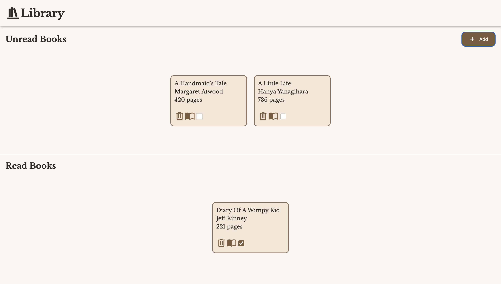

# Book Library
Book library project to practice using objects, object constructors and prototypal inheritance in JavaScript.

Live Preview: https://ninavsworld.github.io/javascript-library/

## How It's Made
**Tech Used:** HTML, CSS, JavaScript

I utilised CSS grid to section the page. Flexbox was used on the grid items to grant flexibility as more books are added. The JavaScript had a focus on basic OOP principles, sprinkled with some mild JavaScript form validation.

## Lessons Learned
I learned that when using preventDefault(), it will override the HTML "required" keyword. This required me to use JavaScript to enforce my desired form validation for adding new books. Additionally, not really a lesson learned but I would like to reduce my use of global code, as there are quite a few lines for query selecting HTML elements. I'm in a bit of a dilemma, because selecting elements in each call of a function seems inefficient, however, the trade off is that there will be more global code.